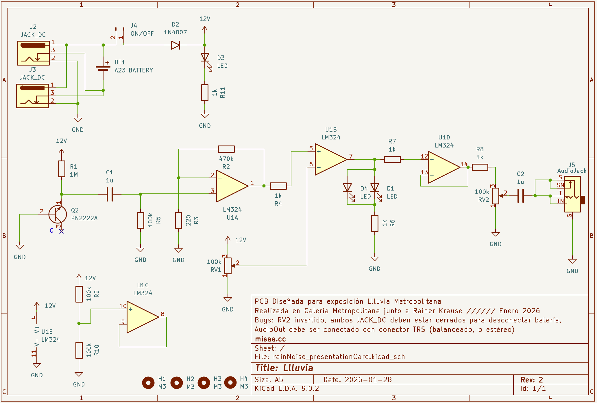
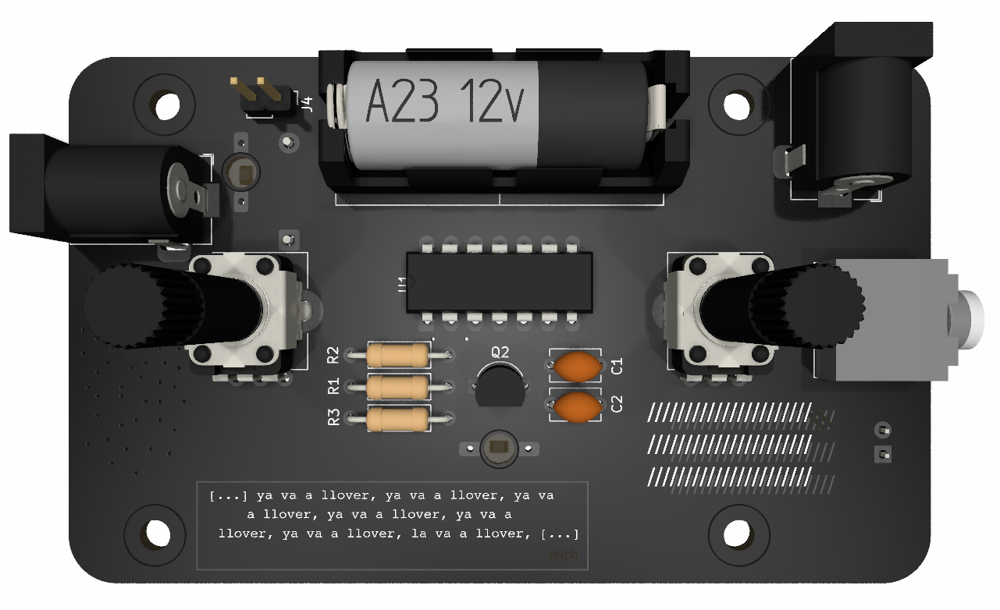
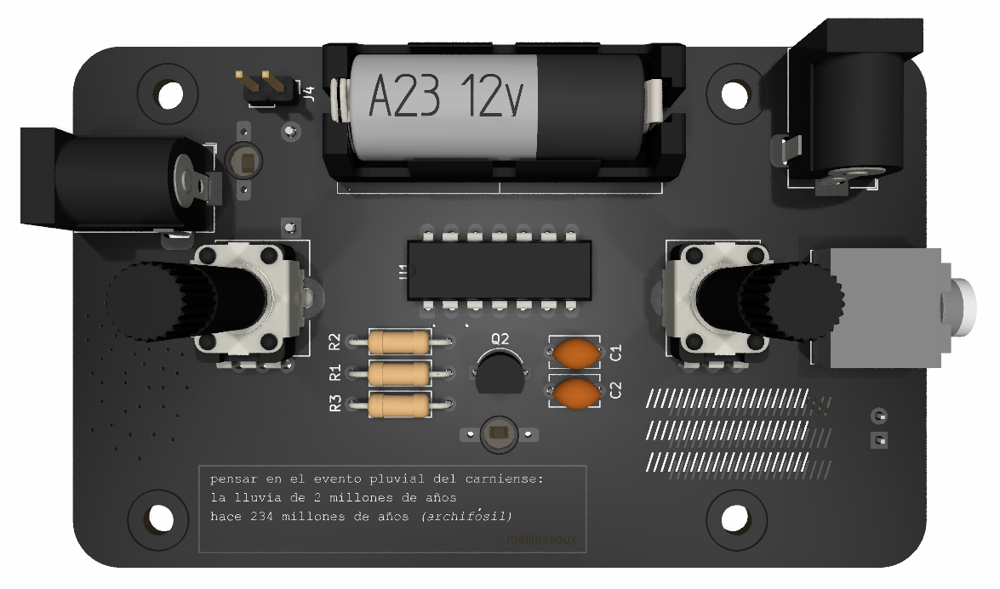
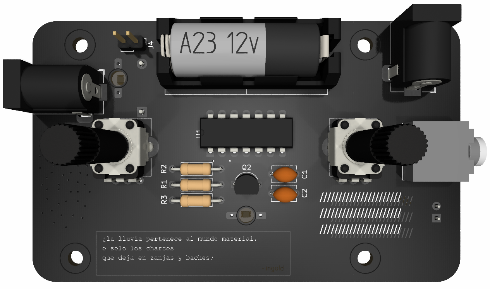
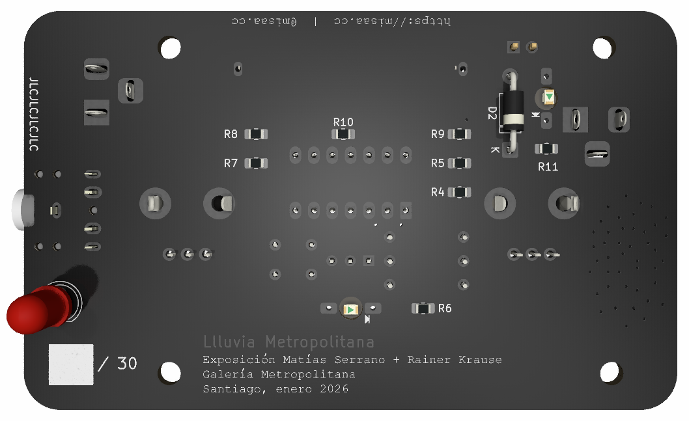
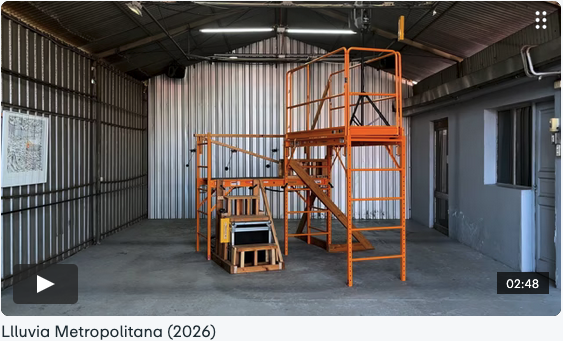

# llluvia-pcb

Circuito generador de gotas de lluvia lumínicas y sonoras

## Descripción

El circuito utiliza un transistor NPN de manera que genera un ruido rosa. Con la base conectada a negativo, el emisor a positivo y el colector desconectado, se genera una conducción inversa a través de la unión base-emisor. Esta configuración crea fluctuaciones aleatorias de corriente que producen variaciones similares al ruido rosa, lo que asemeja el sonido de una lluvia torrencial. Esta señal es llevada a un comparador simple, al que por medio de un potenciómetro se puede controlar cuantas "gotas" se dejan pasar.

## Especificaciones

- Alimentación sugerida de 12 a 15v DC centro positivo
- Alimentación vía batería 23A o fuente de poder DC
- Potenciómetro de control de "gotas"
- Potenciómetro de control de nivel
- Salida para auriculares o de línea (revisar bugs)

## Contexto

La pcb fue diseñada para la exposición "Llluvia Metropolitana", exhibida en enero de 2026 en la Galería Metropolitana junto a Rainer Krause. Se produjeron tres modelos, todos con la misma electrónica, pero con una cita, traducción o paráfrasis distinta en cada una:

"[...] ya va a llover, ya va a llover, ya va a llover, ya va a llover, [...]" - Steve Reich

"pensar en el evento pluvial del carniense: 
la lluvia de 2 millones de años hace 234 millones de años (*archifósil*)" - Quentin Meillassoux

"¿la lluvia pertenece al mundo material, o solo los charcos que deja en zanjas y baches?" - Tim Ingold

## Bugs conocidos

- Para trabajar conectado a una fuente DC se sugiere retirar la batería de 12V 23A, ya que según el circuito solo se desconecta si ambas entradas JACK DC tienen algo conectado
- La salida L y R del conector de audio están puenteadas, por lo que si se conecta un plug MONO (TS) como los del formato Eurorack la salida se aterriza y no suena. Se sugiere intervenir la placa y romper la pista que conecta ambas salidas si se va a utilizar de esta manera. Si se usa con audífonos o con un cable TRS no hay inconvenientes.

## Bom

[Lista de materiales en formato CSV](./llluvia-bom.csv)

| Reference       | Cantidad | Value                     | Footprint                                              | Comentario                                        | Link de referencia                                                                        |
|-----------------|----------|---------------------------|--------------------------------------------------------|---------------------------------------------------|-------------------------------------------------------------------------------------------|
| C1,C2           |        2 | 1u                        | Condensador no polarizado 5.1mm x 3.2mm - Pitch 5.00mm |                                                   | ~                                                                                         |
| D1,D3,D4        |        3 | LED                       | Led 3mm cabeza plana                                   | Montaje invertido (por parte trasera de la placa) | <https://www.railwayscenics.com/flat-warm-white-water-clear-resistor-reqd-p-4583.html>      |
| D2              |        1 | 1N4007                    | Diodo THT TO-41                                        |                                                   | <http://www.vishay.com/docs/88503/1n4001.pdf>                                               |
| J2,J3           |        2 | JACK_DC                   | Conector Barrel Jack 2.1mm x 5.5 mm                    |                                                   | <https://es.rs-online.com/web/p/conectores-de-alimentacion-dc/2858785>                      |
| J4              |        1 | ON/OFF                    | Pin header 2p 2.54mm                                   |                                                   | <https://no.rs-online.com/web/p/pcb-headers/2518086>                                        |
| J5              |        1 | AudioJack2_Ground_Switch  | Jack audio TRS 3.5mm modelo CUI SJ1-3525N              |                                                   | <https://forum.digikey.com/t/cui-sj1-3525n-series-3-5mm-audio-jack-suffix-information/6667> |
| Q2              |        1 | 2N2222A                   | Transistor 2n2222a THT                                 |                                                   | <https://www.onsemi.com/pub/Collateral/PN2222-D.PDF>                                        |
| R1              |        1 | 1M                        | Resistencia 1/4w                                       |                                                   | ~                                                                                         |
| R2              |        1 | 470k                      | Resistencia 1/4w                                       |                                                   | ~                                                                                         |
| R3              |        1 |                       220 | Resistencia 1/4w                                       |                                                   | ~                                                                                         |
| R4,R6,R7,R8,R11 |        5 | 1k                        | Resistencia SMD 0805                                   | Para practicar soldadura SMD a mano :D            | ~                                                                                         |
| R5,R9,R10       |        3 | 100k                      | Resistencia SMD 0805                                   | Para practicar soldadura SMD a mano :D            | ~                                                                                         |
| RV1,RV2         |        2 | 100k                      | Potenciómetro PCB tipo RV09 o PTV09A Vertical          |                                                   | <https://es.rs-online.com/web/p/potenciometros/7377827>                                     |
| U1              |        1 | LM324                     | Circuito Integrado DIP-14 + Socket                     |                                                   | <http://www.ti.com/lit/ds/symlink/lm2902-n.pdf>                                             |
| BT1             |        1 | Batería 12V A23 + Soporte | 12v A23 battery holder THT                             | Solo si se quiere usar con batería                | <https://www.jsumo.com/battery-holder-1-x-23a-with-pins>                                    |

## Esquemático

## Imágenes

## Video de referencia (01:40)

